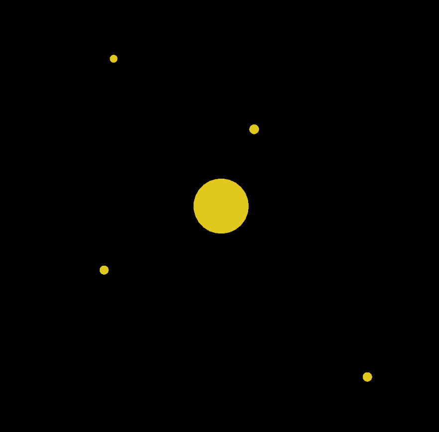

# Gravity Engine

Built with p5.js and Typescript.

### Installing & Usage

```
git clone https://github.com/Gaweph/p5-typescript-starter.git
npm install
npm start
```

Then open browser to `localhost:3000` and click to create planets.


